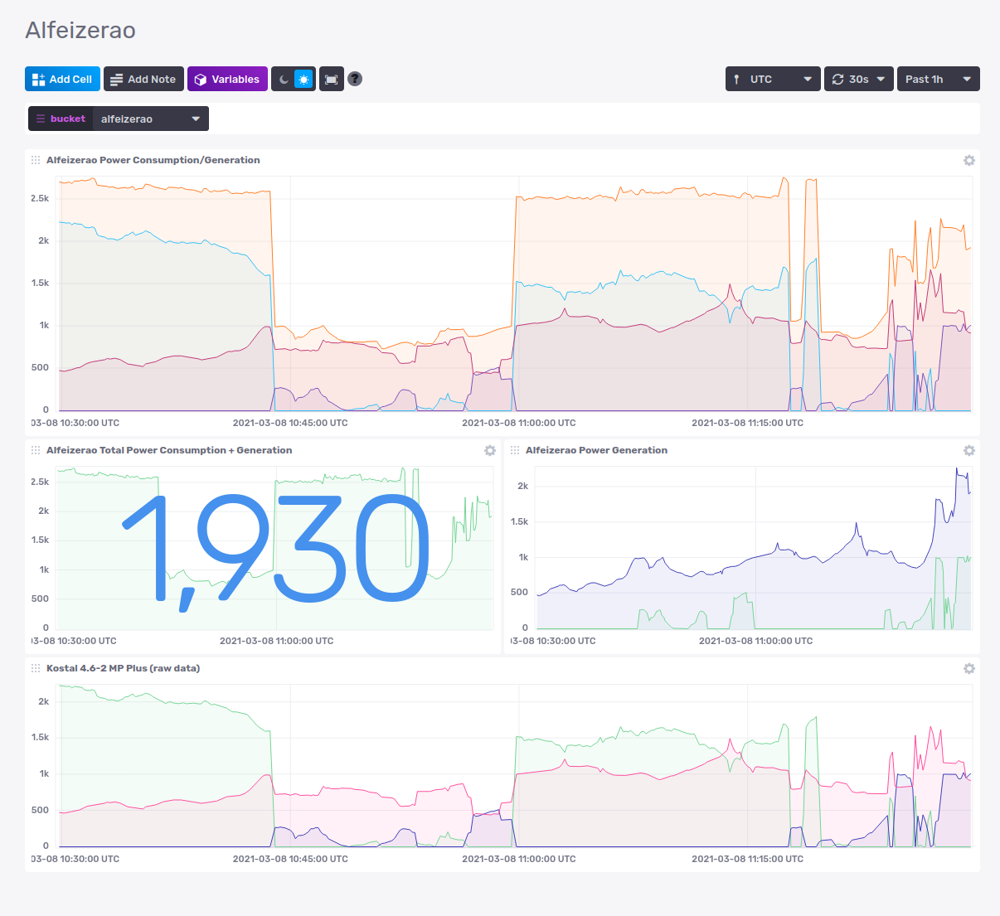

# kostal2influx
extract metrics from kostal inverter for PV Solar and submit them to InfluxDB

## How it gets data from Kostal Inverter PIKO 4.6-2 MP plus

My inverter has an old firmware, so it doesn't have the `http://hostname/api/dxs.json`
So I couldn't use work like: [kostal-dataexporter](https://github.com/svijee/kostal-dataexporter)

So, looking at the source code of the page: `http://hostname/pages/livechart.html`
there's a XML endpoint at `http://hostname/measurements.xml` which is used to read the data.

## InfluxDB v2 data push and dashboards.

I've created a  to monitor my system.
It uses raw data, but it also uses  synthetic metrics to at a glance read total power generation and consumption (see `kostal_inverter_msf`). Here's the [json config of the dashboard](dashboard-influx2.json)

## Security Considerations

This code does have IPs, names and secret tokens in source control.  This IP is local address and inside a overlay network, so 2 layers of security.  The token allows you submit metrics to influx, so.. sure, inside my network, you can submit metrics and maybe DoS my influxDB ?

The real risks and possible impact are low enough for my risk profile, so I accept the tradeoff.

Why letting this be in the code?

Productivity, ability to push a docker image and have zero-config on the server that runs this. That server btw uses declarative configs under source control, so moving the secrets to that place wouldn't increase security.

