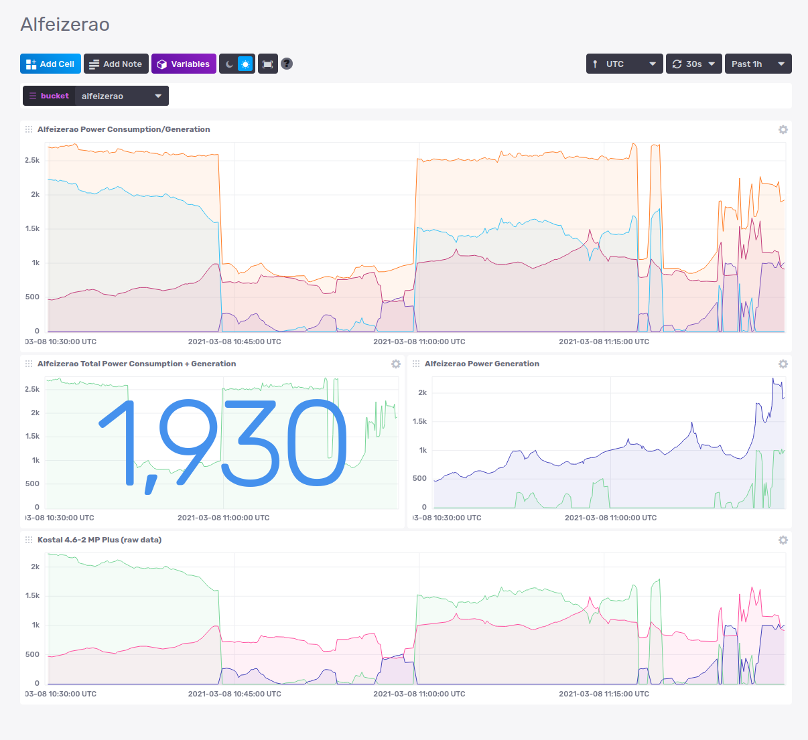

# kostal2influx

Extract metrics from a Kostal PV inverter and write them directly to VictoriaMetrics or InfluxDB v2.

Repositories: [GitHub](https://github.com/msf/kostal2influx) · [Codeberg mirror](https://codeberg.org/mfilipe/kostal2influx)

## VictoriaMetrics

Set `VM_HOST` to write directly to VictoriaMetrics. `VM_PORT` defaults to `8428`, and `VM_TOKEN` optionally sets a bearer token. InfluxDB writes are disabled by default; set `INFLUX_ENABLED=true` to use InfluxDB alone or alongside VictoriaMetrics.

### Background history backfill

When VictoriaMetrics is enabled, a background goroutine fetches `/yields.json?total=0`
and backfills whatever the inverter still remembers, best resolution first. It runs
beside the scrape loop, never inside it: its own paced VictoriaMetrics client
(`-historyPace`, default 250ms between requests) and its own long timeouts, so a
multi-megabyte import can never delay a 5-second reading. It repeats every
`-historyInterval` (default 6h, `0` runs once, negative disables) because
`DayCurves` is a rolling 31-day window: a gap left by an outage is only
recoverable at 10-minute fidelity until it ages out. Every tier
writes the same four metrics — `kostal_AC_Power_W`, `kostal_grid_consumed_watts`,
`kostal_grid_injected_watts`, `kostal_own_consumed_watts` — in watts, and is
identified by a `source` label:

| `source` | from | covers | resolution |
| --- | --- | --- | --- |
| *(absent)* | live `measurements.xml` polling | now | 5s |
| `history_10m_avg` | `DayCurves` | rolling 31 days | 10-minute average power |
| `history_daily_avg` | `MonthCurves` | rolling 13 months | one day's energy as flat average power |
| `history_monthly_avg` | `YearCurves` | up to 20 years | one month's energy as flat average power |

Every tier only fills gaps: the low-resolution ones skip calendar days that already
hold any sample, and `history_10m_avg` skips 10-minute buckets that already hold
one. Energy is therefore never counted twice, and restarting the daemon is cheap
and idempotent. Re-importing a tier means deleting its series first:

```sh
curl -X POST --data-urlencode 'match[]={source=~"history_.*"}' \
  http://victoriametrics:8428/api/v1/admin/tsdb/delete_series
```

Days with zero yield are skipped, so a genuine outage stays a visible gap.

A day's energy is written as 24 hourly samples of constant average power (`Wh / 24`).
That is deliberately lossy in shape but exact in total: the dashboards' hourly
integration `sum_over_time(avg_over_time(x[1h])[1d:1h])` reproduces the inverter's
own daily figure to the watt-hour.

#### Inverter clock correction

These inverters have no NTP: the clock sits at an arbitrary offset from UTC and
free-runs from there (mine is 65 minutes slow). History timestamps are in that
clock, so they are useless until corrected. `HISTORY_OFFSET` defaults to `auto`,
which measures `now - measurements.xml DateTime` at every import and rounds it to
the curve's 10-minute bucket. Pin a Go duration such as `1h5m` to override.

#### Testing the backfill

`make test-e2e` runs the import three times — fresh, restart, restart with a
changed clock correction — against a throwaway VictoriaMetrics **seeded with
live-like data**: 5.5 years of samples with the gaps the real database has, and
`-search.maxSamplesPerSeries` scaled down to keep the production ratio between a
coverage probe and the limit. An empty TSDB only exercises the first-import path
and hides every interesting failure: result alignment, per-series sample limits
and re-import behaviour all need data that is already there.

#### Grafana queries

The dashboards live in [`dashboards/`](dashboards). The `source` label makes each
backfill tier its own Prometheus series, so aggregate it away to render one line:

```promql
sum without (source) (kostal_own_consumed_watts)

sum without (source) (
  sum_over_time(avg_over_time(kostal_grid_consumed_watts[1h])[$__interval:1h])
)
```

The "Sample provenance" panel on each dashboard keeps the tiers visible:

```promql
clamp_max(count_over_time(kostal_AC_Power_W{source="history_daily_avg"}[$__interval]), 1)
```

## Container

The latest published container image is [`ghcr.io/msf/kostal2influx:v0.7`](https://github.com/users/msf/packages/container/package/kostal2influx); `ghcr.io/msf/kostal2influx:latest` currently points to the same image.

```sh
docker pull ghcr.io/msf/kostal2influx:v0.7
```

## How it gets data from Kostal Inverter PIKO 4.6-2 MP plus

My inverter has an old firmware, so it doesn't have the `http://hostname/api/dxs.json`
So I couldn't use work like: [kostal-dataexporter](https://github.com/svijee/kostal-dataexporter)

So, looking at the source code of the page: `http://hostname/pages/livechart.html`
there's a XML endpoint at `http://hostname/measurements.xml` which is used to read the data.

## InfluxDB v2 data push and dashboards.

I've created a  to monitor my system.
It uses raw data, but it also uses  synthetic metrics to at a glance read total power generation and consumption (see `kostal_inverter_msf`). Here's the [json config of the dashboard](dashboard-influx2.json)


